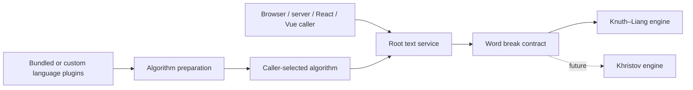

# Runtime soft hyphenation

Status: Approved by the owner.

## Goal and current behavior

Implement runtime insertion of U+00AD SOFT HYPHEN in the main `@elmenov-softworks/typographist` package. Use Knuth–Liang as the first production algorithm. The service must accept interchangeable algorithms through root configuration, so a later Russian Khristov implementation can be added without changes to the service core.

The repository is an Nx npm-workspaces monorepo with four ESM packages. The main package currently has an empty public entry point, no runtime dependencies, an ES2023/NodeNext TypeScript configuration, and a `tsc` declaration build. React, Vue, and Solid packages exist but have no implementation. There is no existing hyphenation API or DOM integration to preserve.

The main package is an environment-independent string processor suitable for server execution and later browser/React/Vue use. This task verifies it in Node.js; browser and framework integration tests belong to separate tasks.

## Research

Liang's dissertation describes language-specific patterns with numeric priorities and compact trie matching. For each inter-letter boundary, overlapping matches contribute weights; the greatest weight wins, and an odd final weight permits a break. Pattern generation from a hyphenated dictionary is a separate offline process, not part of runtime processing. See [Liang's dissertation, pattern matching and examples](https://www.gtoal.com/scrabble/liang/liang-thesis.pdf).

Existing implementations provide useful comparisons:

| Implementation                                                                 | Observed design                                                                                                               | Relevance                                                                                                                                            |
| ------------------------------------------------------------------------------ | ----------------------------------------------------------------------------------------------------------------------------- | ---------------------------------------------------------------------------------------------------------------------------------------------------- |
| [Hypher source](https://github.com/bramstein/hypher/blob/master/lib/hypher.js) | Builds a trie from supplied patterns; separates word matching and text processing; supports exceptions and left/right limits. | Reference for matching behavior; its UTF-16 splitting and text heuristics must not be copied without checking Unicode and preservation requirements. |
| [hyphen](https://github.com/ytiurin/hyphen)                                    | Provides a pattern-based factory, language data, exceptions, and synchronous/asynchronous usage.                              | Shows that language data and execution mode need explicit contracts. Its HTML-string processing is not a requirement for this project.               |
| [Hyphenopoly](https://github.com/mnater/Hyphenopoly)                           | Separates DOM processing, a server module, and language-specific WASM resources.                                              | Supports keeping environment integration separate from the engine; WASM and automatic resource loading are not required here.                        |

The [Russian TeX pattern source](https://github.com/hyphenation/tex-hyphen/blob/master/hyph-utf8/tex/generic/hyph-utf8/patterns/tex/hyph-ru.tex) identifies Alexander I. Lebedev as author, specifies LPPL 1.2 or later, and lists left/right minima of 2/2. It is the approved Russian data source for this specification. Any selected data needs pinned provenance and its own notices; the library's MIT license does not replace data licensing.

The [CSS Text specification](https://www.w3.org/TR/css-text-3/#hyphenation) treats U+00AD as a conditional opportunity. The library inserts opportunities; the renderer decides actual line breaks. It must not calculate line widths or promise identical visual wrapping between environments.

The requested future Khristov engine remains out of scope. Its precise variant and comparative speed, size, and accuracy must be established in that later task, rather than promised without measurement here.

## Confirmed scope and requirements

- Implement the first algorithm in the main package using Knuth–Liang.
- Treat high runtime performance as a primary requirement while retaining the agreed accuracy, Unicode safety, and text preservation. Use an efficient asymptotic design and verify practical performance in Node.js. Outperforming other libraries is not an acceptance condition.
- Separate algorithm logic from common text processing. This package processes strings only and has no DOM integration.
- Select the algorithm at root service configuration. Common text processing must not contain branches for named algorithms.
- Bundle Russian (`ru`) and American English (`en-US`) language plugins only. Accept caller-supplied language plugins through the same public contract without edits to the core.
- Process text synchronously with a prepared algorithm and language data.
- Preserve a whole word that already contains U+00AD.
- Support user exceptions, configurable left/right minima and minimum word length, and exclusions for URLs, email addresses, and technical identifiers.
- Expose a contract that external algorithms can implement without modifying the core or a closed algorithm-name union.
- Preserve ESM packaging, strict TypeScript, declarations, Nx builds, and Vitest.
- Keep React, Vue, and Solid wrappers outside this implementation task. The main API must be usable by those packages later.
- Do not implement DOM processing, HTML parsing, Khristov, runtime pattern training, or layout measurement. Preparing this document does not launch implementation.

## Architecture and agreed contracts

Use three responsibility boundaries: algorithms, language plugins, and the root text service. These are conceptual modules; implementation follows the project's feature and file-role conventions.

**Algorithm boundary.** A prepared algorithm contains its supported language profiles and a synchronous word-break function. The function accepts a complete original word, a registered language identifier, and the shared analysis already produced by that profile, and returns strictly increasing unique UTF-16 insertion offsets in that original word. Empty positions mean no break. Each position must be a safe integer strictly inside the word, at an original grapheme boundary. The algorithm is called only when no exception applies and returns candidates without applying service-level length limits. It must not insert U+00AD, tokenize text, fetch data, or access framework/DOM state.

Use function contracts and object types for algorithms and a factory for the root service. There is no need for a class registry or inheritance hierarchy. The future second algorithm supplies the same contract without pattern data. Algorithm modules do not import the service.

**Root service.** Capture the prepared algorithm and text policy in an instance. Require an explicit algorithm argument; select another algorithm by creating another instance. Obtain language profiles from that algorithm rather than accept a second independently configurable list. This prevents the service and engine from disagreeing about language support, normalization, or limits. The root handles tokenization, language routing, exclusions, exceptions, minimum lengths, result validation, and U+00AD insertion. It never inspects a Liang-specific pattern format or branches on algorithm names.

The public surface consists of synchronous algorithm preparation from plugins, root service creation, and `hyphenate(text, options?)` returning a string. Root options include the prepared algorithm, required default language, optional word selector, per-language limits and user exceptions, and exclusion settings. Per-call options override the language only. Export the necessary extension types and the two bundled plugins from the existing public entry point. Exact factory/type names and internal file layout are implementation choices; all error and precedence behavior below is part of the contract. A convenience factory is unnecessary for this version.

**Language plugins.** Common language metadata contains a language identifier, a supported-word/normalization operation, default limits, and optional language exceptions. Normalization returns either an analysis form with an original-boundary map or `null` for an unsupported word. Liang plugins extend that metadata with pattern data; other algorithms can accept common profiles without any pattern property. The Liang preparation API consumes these plugins and returns an engine carrying the same prepared profiles. New language identifiers are open strings, not a closed `ru | en-US` union.

Register only supplied plugins. Bundled plugins are available to import but not automatically activated. To replace a bundled plugin, supply the custom plugin instead of it when preparing the engine. Duplicate language identifiers fail preparation. Identifier lookup is case-insensitive (`en-us` resolves to `en-US`); region fallback is not performed (`en` and `en-GB` are distinct, unregistered identifiers unless explicitly supplied). Require a nonempty identifier made of ASCII letters/digits separated by single hyphens; compare its ASCII lowercase form, without `Intl` locale negotiation. Reject empty segments or leading/trailing whitespace instead of trimming silently. No automatic discovery is required.

Validate and snapshot configuration, pattern arrays, language data, and exception tables at preparation/creation. Later mutation of the caller's data must not alter a running instance. Callback functions remain caller-owned and must be synchronous and deterministic; the library does not attempt to clone closure state. Prepared profiles and internal indexes are immutable to consumers. Reuse them across calls without process-global mutable configuration.

**Runtime contract.** Asynchronous data loading, if needed, happens outside preparation. String processing uses no I/O, DOM globals, Node-only imports, or React/Vue dependencies. Public declarations must compile without DOM or Node ambient types. The implementation may use standard Unicode facilities such as `Intl.Segmenter` for graphemes; record any runtime prerequisite and use the same boundary policy in engine validation and exceptions. Do not add a handwritten approximate grapheme fallback. Node.js validation uses the project runtime; browser compatibility is a later verification task.

Deterministic callbacks, matching pattern data, and compatible Unicode segmentation behavior produce identical output. Avoid locale-dependent word segmentation and process-default locale casing for the bundled languages. Universal equality across different Unicode/ICU versions is not promised; [ECMA-402 permits implementation-dependent boundary behavior](https://tc39.es/ecma402/#sec-findboundary). Later SSR integrations must use compatible data, policies, and Unicode behavior during hydration.

## Knuth–Liang behavior

Interpret numeric pattern weights between letters, including implicit zero weights and word-boundary anchors. Match all applicable patterns against the algorithm's matching representation. Combine overlapping contributions by maximum, independent of pattern order. An even maximum suppresses weaker odd suggestions; a stronger odd maximum restores a permitted boundary. Map candidates back to original offsets and exclude artificial boundary markers.

Consume prepared pattern data, not executable TeX. Use classical pattern strings: Unicode code points as matching symbols, digit weights 0–9, implicit zero weights, and `.` only as a leading/trailing word-boundary anchor. Patterns are already in the language profile's matching form. The public input is a pattern list, not a TeX document. Spelling-replacement extensions are outside this insertion-only algorithm contract. Repeated patterns with the same character key combine their weights by maximum; never let array order overwrite a stronger value. Reject malformed pattern data and unsupported encodings during preparation. Keep literal characters distinct from the reserved anchor and weight syntax.

Convert both pattern blocks and source exception blocks into the bundled plugins. Both selected [Russian](https://github.com/hyphenation/tex-hyphen/blob/master/hyph-utf8/tex/generic/hyph-utf8/patterns/tex/hyph-ru.tex) and [American English](https://github.com/hyphenation/tex-hyphen/blob/master/hyph-utf8/tex/generic/hyph-utf8/patterns/tex/hyph-en-us.tex) sources contain `\hyphenation` entries. An entry without a hyphen is a deliberate no-break exception. Omitting these blocks changes language behavior even with an otherwise correct matcher. Preserve all source patterns, including ones unused by the first-version compound policy. Record that splitting visible-hyphen compounds into components is this library's text policy, not complete TeX paragraph behavior.

The conversion is a bounded preparation step for these known source files, with pinned revision, checksums, counts, and a reproducible local command. It is not a general TeX interpreter or pattern-training system. Keep converted data in the package so ordinary builds, imports, and tests do not fetch upstream files. No WASM, workers, or new runtime dependency is required.

## Performance and accuracy

The owner requires accurate, fast processing with an efficient asymptotic design. There is no requirement to beat competing libraries and no hardware-dependent numerical threshold. Performance verification runs only in Node.js using built-in timing facilities; do not install benchmark libraries or competing implementations for this task. Browser, DOM, and framework performance work belongs to later tasks.

Prepare pattern indexes once and reuse them across calls. Do not scan every pattern for every word or repeatedly copy the whole output after each insertion. Process text with a bounded number of passes, accumulate untouched spans and inserted U+00AD characters, and assemble the result once. Multiple linear passes are acceptable when clearer or faster than a more complicated single pass. Keep output order so break-position sorting is unnecessary. Validate all offsets of a word with one boundary index/scan; do not resegment the word for every returned position. Validate exception tables and pattern syntax once during preparation, not for every text call.

Use a prepared trie as the baseline matcher, with traversal bounded by the longest loaded pattern. Analyse weight aggregation as well as matching; a trie alone does not establish linearity when pattern size also grows. Let `N` be original input length in UTF-16 code units, `M` total analyzed word length in matching symbols, `L` maximum pattern length in those symbols, `P` total pattern input size, `U` the number of weight contributions actually applied, and `B` inserted breaks. Under constant-time child lookup, a bounded-trie implementation has matching/aggregation cost `O(M × L + U)`, with reconstruction `O(N + B)`. A straightforward matcher may have `U = O(M × L²)` in the worst case. Report these parameters rather than calling it unconditionally `O(N)`.

For fixed prepared `ru`/`en-US` tables, `M = O(N)`, `L` and per-position pattern contributions are fixed, so target `O(N + B)` processing in input size. Reading input and producing output already require that order of work. Preparation should be proportional to pattern data size for the baseline trie, and temporary storage should remain bounded by input/output and prepared data, without an unbounded word cache. State separate bounds for any chosen compiled representation. The bundled alphabet lookup and scanner must support these bounds; include custom normalizer expansion and callback costs separately. Also account for normalization, grapheme handling, exclusion recognition, and language dispatch. The library cannot bound arbitrary user callbacks' execution cost; report that separately.

The implementer may make multiple bounded local experiments to choose a better representation or reduce allocations, while retaining the public contracts and test results. Compare candidate implementations against the baseline on the same fixtures; select the simplest candidate that meets the asymptotic target and performs well on representative inputs. Do not claim one universally optimal algorithm from Big-O notation alone. Compact tables and fast paths need measured justification; WASM, workers, native dependencies, and memoization are not part of this task.

Validate optimized paths against the baseline, including Unicode and reentrant calls from custom selectors/plugins. Optimizations must not skip words, relax language limits, change exceptions, or damage original characters to improve timing. If reusing buffers, establish ownership and ensure nested calls cannot corrupt a preceding call.

### Node.js measurements

Record the Node.js version, hardware, source revision, workload sizes, warm-up, and repeated-run timing method. Measure preparation separately from processing with a ready instance. Use short strings, paragraphs, long texts, repeated words, varied vocabulary, and mixed Russian/English routing. Include uppercase text, combining marks, excluded tokens, and existing U+00AD. Consume and validate outputs before interpreting timings.

Use increasing input sizes and long individual words to look for accidental superlinear work. Include inputs with little repetition so cache effects cannot disguise matcher cost. Report complete service latency/throughput and preparation cost; memory and shipped size may be reported when useful, without introducing separate numeric gates. Benchmark the emitted JavaScript, not Vitest transformation/startup. Keep timing measurements outside correctness tests; noisy machine timings must not make ordinary CI tests flaky. No comparative library ranking is required.

### Accuracy fixtures

A corpus is a collection of words/texts with expected behavior. This task does not require obtaining a separate external corpus or approving a corpus dependency. Use deterministic fixtures in the existing Vitest suite: synthetic patterns with hand-derived results for Knuth–Liang mechanics, representative Russian and `en-US` words tied to the selected data, and text-preservation/exception cases. Add regression examples for any discovered defect. The implementer can choose these fixtures within the agreed behavior without seeking approval for each example.

Synthetic fixtures must include odd/even overrides, stronger-odd restoration, word anchors, overlapping matches, minima, and pattern-order independence. Language fixtures are spot checks, not proof of perfect linguistic coverage. Document source-data limitations and preserve them through optimization unless an explicit exception addresses them. Every optimized candidate must produce the same expected results; a permanently duplicated reference engine is not required in production.

## Text policy

### Language selection and processing order

Require a registered default language at creation. Validate a per-call language override before processing, including for empty input. The optional root-level selector receives the original candidate word and the effective call language. Its registered identifier selects the language; `null` preserves the word. Without a selector, use the effective call language. A selected but unregistered identifier is an error. The core does not infer a language from script.

Apply policy in this order:

1. Validate the call and identify protected address spans and candidate tokens.
2. Preserve tokens with existing U+00AD and tokens rejected by enabled exclusions. They do not invoke user selectors, exceptions, or the algorithm.
3. Select a language and obtain its word analysis. A selector returning `null`, or a profile rejecting the complete word, preserves it.
4. Enforce minimum word length. Use a matching user exception, then a plugin exception, then algorithm candidates, in that order. An exception replaces candidates completely; an empty list prevents hyphenation. The algorithm is not called for exception matches.
5. Validate candidate offsets once at the public algorithm boundary, then filter valid candidates by left/right limits and assemble output from original slices.

Exceptions cannot override preservation of existing U+00AD, exclusions, unsupported word forms, or configured limits. Disable the relevant configurable exclusion explicitly when processing such a token is intended; its selected language/algorithm must also support that token. Callback/algorithm exceptions propagate; no partially processed string is returned.

### Tokens and exclusions

Use a documented scanner for maximal runs of Unicode letters, marks, numbers, underscore, internal apostrophes, and U+00AD. Joiners or lone surrogates embedded between word characters stay with the candidate so an unsupported token is not split around them. Group non-breaking-hyphen compounds before applying the separate preservation rule below. Retain internal marks and apostrophes for whole-token eligibility decisions. Do not split a mixed-script word into independently hyphenated fragments simply because one plugin recognizes only part of it. This contract supports plugins for letter-based word runs; dictionary segmentation of scripts without explicit word boundaries is outside this version.

Protect URLs beginning with an ASCII scheme followed by `://`, and case-insensitive `www.` addresses, up to whitespace or a quote/angle-bracket delimiter. This protection may conservatively include trailing punctuation in the same span; do not hyphenate text within that span. The email recognizer covers ASCII dot-atom local parts and hostname labels with at least one dot; Unicode/quoted local parts are outside the built-in recognizer. Recognize ordinary email spans before splitting punctuation, including local parts with dots, plus signs, or hyphens. Keep these recognizers bounded and avoid regex backtracking that becomes quadratic or exponential on long near-matches. Document the supported forms rather than claim complete URI/email parsing. Plain strings are not HTML: do not interpret tags, entities, Markdown, or escapes.

Default configurable exclusions preserve addresses, numeric/alphanumeric tokens (`12345`, `v2`, `ISO9001`), underscore identifiers (`user_name`), and identifiers with an internal lowercase-to-uppercase transition (`userName`, `UserName`). An optional custom exclusion predicate can add excluded tokens. Each built-in exclusion category can be disabled at root configuration; malformed option values fail rather than silently enable/disable it. This does not expand a language plugin's supported alphabet.

U+002D HYPHEN-MINUS and U+2010 HYPHEN separate compound components, which are processed independently. Preserve separator characters exactly. A component containing U+00AD is left unchanged while another component may be processed. Preserve compounds joined with U+2011 NON-BREAKING HYPHEN as a whole. Words with internal U+0027 or U+2019 apostrophes remain unchanged for the bundled plugins; enclosing quotation marks remain separators. Title-case and all-uppercase natural-language words are otherwise eligible.

Keep whitespace, punctuation, emoji, joiners, variation selectors, and ill-formed UTF-16 code units unchanged. A token containing an unsupported code unit or letter form is preserved in full, rather than partially matched. Do not insert at an artificial boundary inside a grapheme cluster.

### Unicode analysis and offsets

For bundled profiles, analyze a private representation using NFC and explicit locale-independent lowercasing. Russian supports the modern Russian alphabet including `ё`; English supports ASCII letters after this normalization. Never collapse `ё` into `е`. Canonically decomposed `е` plus diaeresis must match `ё` while preserving both original code units. Accented/foreign forms that remain outside the plugin alphabet, including Russian stress marks, preserve the complete word in this version; supporting their hyphenation can be supplied by a custom plugin.

Normalization is not assumed to preserve length: NFC may combine characters and case conversion may expand them. The profile's analysis contains the normalized code-point sequence and a map for its inter-symbol boundaries, with `null` for unrepresentable boundaries. Representable entries increase strictly, start at original offset 0, end at the original word length, and reference only original UTF-16 grapheme boundaries. Do not drop or reorder original graphemes in normalization; composition and case expansion are supported, transliteration/deletion is not part of this mapping contract. Boundaries inside an expansion have no original insertion point. The engine must discard such internal suggestions during mapping, never round them to a nearby character. Validate malformed mappings at the plugin boundary and propagate an error; `null` is for unsupported words, not broken plugin output.

Use one shared analysis contract for matching and exception lookup. Bundled analysis and original grapheme counts are computed once per processed word and reused where possible. An implementation may add fast paths for the bundled alphabets if they preserve these results. Grapheme boundaries and counts follow [Unicode text segmentation](https://unicode.org/reports/tr29/); word tokenization follows this document's scanner policy rather than locale-dependent `Intl.Segmenter` word heuristics.

### Exceptions, limits, and repeatability

Register exceptions by language, an example word, and sorted unique UTF-16 break offsets in that example. Validate offsets against its original grapheme boundaries, normalize its lookup key with the same language profile, and translate positions into mapped normalized boundaries at creation. At lookup, translate them back to the current original word. If an exception boundary is unrepresentable for a particular normalized-equivalent spelling, omit that candidate rather than shift it or fall back to the algorithm. This makes case variants and canonical equivalents use the same exception without applying offsets from a differently sized string. Reject unsupported examples, conflicting duplicate normalized keys within one table, and invalid offsets. User entries deliberately override plugin entries with the same normalized key.

Language defaults are `leftMin = 2`, `rightMin = 2` for `ru`, and `leftMin = 2`, `rightMin = 3` for `en-US`. Configure per-language overrides on the root instance. Left/right values must be positive safe integers no smaller than plugin defaults. `minWordLength` is a non-negative safe integer, defaulting to 0 (no additional cutoff). Omission selects a default; invalid numbers fail configuration. A word exactly at a threshold is eligible. A break after `k` original graphemes is permitted when `k >= leftMin` and `length - k >= rightMin`; limits apply equally to exceptions and algorithm candidates.

With unchanged configuration and deterministic callbacks, repeated processing must satisfy `hyphenate(hyphenate(text)) === hyphenate(text)`. Scan U+00AD as part of its original token before other filters so it does not split a word into new candidates on the next call. Original manually inserted U+00AD is never removed, moved, or duplicated. Empty text returns an empty string after call validation. Identity of mutable buffers, cached results, or caller data must not affect the returned string.

### Error contract

Use ordinary `TypeError` for wrong input shapes, non-synchronous plugin results, and malformed patterns/contracts (including identifier syntax); use `RangeError` for invalid language selections, duplicate language registrations, numeric limits, and invalid break offsets. Messages identify the offending option, language, or plugin without embedding the complete input text. The exact message wording is not a public contract. No custom error hierarchy is needed. Wrongly shaped algorithm outputs are `TypeError`; numeric offset arrays that are unsorted, duplicated, out of range, fractional, or inside a grapheme produce `RangeError`; valid offsets excluded by configured minima are simply omitted.

## Acceptance criteria

Confirmed requirements:

1. The first production engine follows numeric Knuth–Liang pattern matching rather than a syllable heuristic.
2. A test algorithm changes word break positions through root configuration alone, with no edit to common processing. This test fixture demonstrates substitution without implementing Khristov prematurely.
3. The text API accepts strings only; the package has no DOM API, imports, types, or browser-global access.
4. Both bundled language plugins and an externally supplied test plugin work through the same registration contract, without changes to the core.
5. The core can be imported and called in Node.js without browser globals or Node-only runtime imports. Preserve environment-independent deterministic processing; actual browser/framework integration testing is deferred.
6. The public ESM entry point and declarations remain usable, and the existing release automation tests continue to pass.
7. The implementer documents preparation and processing complexity with all relevant parameters, meets linear input-size behavior for fixed prepared built-in tables, and supplies Node.js measurements of preparation and complete service processing, including long words, long combining-mark runs, and exclusion near-matches. Optimized candidates preserve all correctness fixtures; beating another library is not required.

Verify overlapping odd/even patterns, anchors, pattern order independence, language minima, exceptions, uppercase Russian words, `ё`, empty/short words, combining accents, emoji, existing U+00AD, visible-hyphen compounds, and excluded technical tokens. Expected linguistic examples must be tied to the selected pattern version or explicit exceptions; agreement with one other library alone is not proof of correctness.

Verify synchronous return values, unchanged existing U+00AD words, repeated processing, custom plugin registration, user exception precedence, configurable limits, and isolation between separate service instances. English fixtures use `en-US` patterns. Verify default language, per-call override, selector precedence, selector `null`, a mixed Russian/English string, words outside a plugin's alphabet, and errors for unregistered language identifiers. Assert that `en-GB` does not silently select `en-US`. Test the listed technical-token fixtures and configurable exclusions.

### Required examples

`\u00AD` and other escapes below denote actual code points, not literal backslash text. Synthetic tests use an ASCII plugin with left/right minima of 1 and no word-length cutoff.

| Case                      | Setup/input                                                   | Expected result                                           |
| ------------------------- | ------------------------------------------------------------- | --------------------------------------------------------- |
| Even weight wins          | Patterns `a1b`, `a2b`; `abcd`                                 | `abcd`                                                    |
| Stronger odd weight wins  | Add `a3b`; `abcd`                                             | `a\u00ADbcd`, independent of pattern order                |
| Source exception          | Bundled `en-US`; `table` / `TABLE`                            | `ta\u00ADble` / `TA\u00ADBLE`                             |
| Source no-break exception | Bundled `en-US`; `present`                                    | `present`                                                 |
| Russian source exception  | Bundled `ru`; `асбест`                                        | `ас\u00ADбест`                                            |
| Canonical offset mapping  | `ru`, user exception `ёлка` with offset 2; input `е\u0308лка` | `е\u0308л\u00ADка`                                        |
| Manual opportunity        | `пе\u00ADренос`                                               | Exact input; selector and engine are not called           |
| Unsupported mark          | Bundled `ru`; `ма\u0301шина`                                  | Exact input, no partial processing                        |
| Excluded email            | `first.last+tag@example-domain.com`                           | Exact input with default exclusions                       |
| Non-breaking compound     | `mother\u2011in\u2011law`                                     | Exact input                                               |
| Exact minimum boundary    | Synthetic `b1c`, `abcd`, limits 2/2                           | `ab\u00ADcd`; raising left minimum to 3 removes the break |
| Invalid override          | Empty text with unregistered `en-GB` override                 | `RangeError`                                              |

Also verify invalid third-party offsets/mappings, `NaN`/infinite/fractional limits, normalized exception collisions, case-insensitive duplicate language registration, custom-plugin replacement, caller-data mutation after preparation, and reentrant callbacks. Tests must distinguish invalid contract data from a valid no-break/unsupported-word result. A custom test plugin and a custom test algorithm must each work without modifying the core or adding a language/algorithm name branch.

The caller, not this package, owns DOM, HTML escaping, CSS, and framework lifecycle. Browser visual checks, DOM operations, and framework integration tests are deferred to their own tasks; they are not acceptance conditions here.

## Verification

Research completed for this specification: working-tree and configuration inspection; study of Liang and the linked implementations; inspection of both source exception blocks and Unicode segmentation contracts. A read-only Node.js experiment checked decomposed `ё`, combining stress, case expansion, emoji graphemes, and lone surrogate preservation. No implementation or performance measurement was performed. The specification was the only untracked project artifact during this review.

Future implementation checks:

- `npm run test --workspace=@elmenov-softworks/typographist`: behavior and boundary tests for the main package.
- `npm test`: workspace tests, including release automation regressions.
- `npm run lint` and `npm run format:check`: project checks without modification.
- `npm run typecheck`: root and package type checking.
- `npm run build`: ESM and declaration builds for all packages.
- Import the built core and transform fixtures in Node.js without DOM globals.
- Provide a reproducible, documented Node.js benchmark command separate from `test`, using built-in timing facilities; record preparation/processing measurements and complexity bounds. Do not invent a passing command before it exists.
- Inspect `npm pack --dry-run --workspace=@elmenov-softworks/typographist`: public ESM/declarations, both converted datasets, and required source/license notices must be included.
- Compile a server consumer without DOM libraries; verify no DOM types or Node-only runtime requirements leak into the published core contract.

Current CI also executes each wrapper package's test target. Those empty packages have no tests, as already documented in README; this task must not invent wrapper tests merely to clear that separate existing condition. This specification does not claim those future checks have passed.

## Constraints, decisions, and approval

The owner requires fast processing without sacrificing accuracy, an efficient Big-O design, and Node.js-only performance evaluation; comparison against other libraries is not required. Multiple local candidate-evaluation passes are allowed. The owner approved the reviewed specification, including the algorithm, language-plugin, and service contracts. The owner confirmed `ru` and `en-US`, external custom language plugins, strings only, synchronous execution, preservation of existing U+00AD words, configurable exceptions/limits/exclusions, and the default/per-call/optional-selector language routing described above. Language, scope, and evaluation questions are resolved. No external corpus, benchmark dependency, browser test suite, or numerical performance gate needs separate selection for this task. Internal representation, fixture selection, and optimization choices may be decided by the implementer within the stated contracts; they do not authorize changes to observable behavior or additional dependencies.

Bundle the converted data and required source/license notices in the actual npm tarball, not only in repository documentation. The current package publishes `dist` only, so include these artifacts in emitted/package contents and verify them with `npm pack --dry-run`. Keep data licensing separate from the package MIT license.

Use [Russian hyph-ru.tex](https://github.com/hyphenation/tex-hyphen/blob/master/hyph-utf8/tex/generic/hyph-utf8/patterns/tex/hyph-ru.tex) and [American English hyph-en-us.tex](https://github.com/hyphenation/tex-hyphen/blob/master/hyph-utf8/tex/generic/hyph-utf8/patterns/tex/hyph-en-us.tex) as the approved bundled data sources. The American source lists minima of 2/3 and permits redistribution with its notices preserved. Pin the actual source revision and retain each data source's licenses/notices when converting tables. Approval includes these source choices; no third-party runtime library is required.

Follow the root `AGENTS.md`, `.codex/AGENTS.md`, and their routed supporting rules. Keep algorithm and language contracts small, use role-specific files for exported types, infer function return types, and avoid unapproved type assertions or dependencies. Test behavior with Vitest and preserve the existing release/documentation workflows.

## Implementation report

Before handing the implementation over for manual review, commit `specs/feature/base-knuth–liang/runtime-hyphenation-report.md` with the delivered API and behavior, completed checks, remaining limitations, and reproducible Node.js benchmark results. Include:

- The measured implementation commit, pattern source revisions, Node.js version, OS/CPU, benchmark command, and dataset sizes/content descriptions.
- Preparation time separately from processing with a reused prepared service; warm-up, iteration counts, timing units, and a summary of repeated samples rather than one best run.
- Full-service measurements for Russian, American English, mixed text with explicit routing, repeated words, and the adversarial inputs required above. Include input lengths and throughput, and compare increasing input sizes to assess scaling.
- The candidates considered, relevant measured tradeoffs, the chosen design, and its complexity. Record actual observations; do not claim superiority over unmeasured alternatives.
- Check outcomes, any pre-existing failures, and evidence locations. Do not report GitHub CI as passed before a branch has been published and CI has run.

Measurements must cover the final implementation; repeat affected measurements after runtime changes. Later documentation-only commits need not invalidate the recorded implementation revision. The coordinator's final response must summarize the measurements and link the report. Missing or failed measurements must be reported as incomplete, never replaced with estimates.

## Handoff and execution authorization

The owner approved this specification and separately requested its documentation commit and a prompt for a later `run-task` launch. Preparing this handoff does not itself start implementation or the orchestrator.

For the later implementation run, the owner preauthorizes task-scoped edits, local debugging scripts and experiments, test/lint/format/type/build checks, Node.js benchmarks, and granular local commits. Decide routine implementation details within this specification without asking again. Follow the orchestrator's ownership of Git operations: workers supply coherent changes and commit messages; the coordinator creates commits. These permissions do not override sandbox restrictions or project rules.

The owner subsequently authorized the standard orchestrator publication flow: pushing the task feature branch and creating/updating its PR after configured checks and independent agent review. This replaces the earlier requirement to stop before push for manual review. Ordinary merges from the configured base branch into the task branch are authorized as part of that flow. Manual owner review remains required before merging the PR; do not merge it, push the base branch or tags, release packages, or publish documentation as part of this task.

The manual orchestrator requires a clean existing feature branch and a committed specification. Use its documented `--approve` execution flow when the owner starts the implementation session. No local-only mode or external orchestrator modification is required. Wait for the configured GitHub checks on the reviewed PR head and report their actual outcome, including any blockers.
